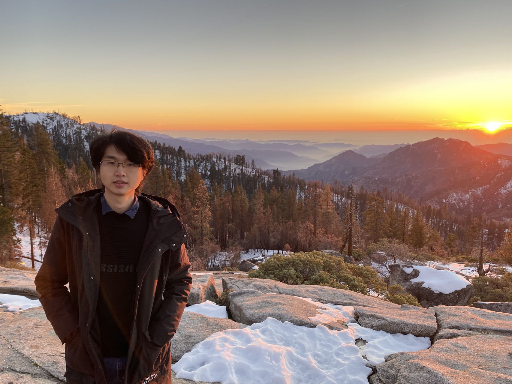

I'm an MSCS student from <a href="https://www.cs.usc.edu/" style="text-decoration:none">Thomas Lord Department of Computer Science</a>, <a href="https://www.usc.edu/" style="text-decoration:none">University of Southern California</a>. I'm intereseted in computer vision, robot visual navigation and robot manipulation with multi-modal prompts. My current research is about empowering intelligent robots with pre-trained foundational models. 

I am very fortunate to be advised by <a href="http://ilab.usc.edu/itti/" style="text-decoration:none">Prof. Laurent Itti</a> of iLab at USC.
You can find my CV here: <a href="../assets/Chen_Liu_Resume.pdf" style="text-decoration:none">Chen's Curriculum Vitae</a>.

Preprints
========
        
 
<td width="75%">
    <a href="https://sites.google.com/usc.edu/world-model-sim2real" style="text-decoration:none">
        <papertitle>Worl d model-based Sim2Real Transfer for Robot Visual Navigation</papertitle>
    </a>
     
        <strong>Chen Liu*</strong>, Kiran Lekkala*, Laurent Itti
     
    <em>Preprint. Under Review. </em>
    
We propose a robust system that integrates a control policy, trained within a simulator, with an internal LSTM-based world model and an external visual perception model, facilitating seamless application of the policy in real-world scenarios.

</td>
 
<td width="75%" valign="middle">
    <papertitle>Real-world Robot Visual Navigation in a Simulator: A New Benchmark</papertitle>
     
        HengHui Bao*, Kiran Lekkala*, <strong>Chen Liu</strong>, Laurent Itti
     
    <em>Preprint. Under Review. </em>
    
We collect a large augmented dataset comprising panoramic RGB images annotated with pose stamps and developed a simulator that allows for seamless evaluation of reinforcement learning methods on robot visual navigation tasks. 

</td>

Ongoing Research
========
 
<td width="75%" valign="middle">
    <papertitle>Facilitating Diverse Manipulation with Vision-Language Model</papertitle>
     
        <strong>Chen Liu</strong>, Sumedh Sontakke, Daniel Seita, Laurent Itti
     
    
We introduce a multi-task robotic system that empowers robots to perform long-horizon manipulation tasks by mimicking a human demonstration video. 

</td>

 
<td width="75%" valign="middle">
    <papertitle>Language to Plans for Hierarchical Multi-Agent Path Finding</papertitle>
     
        <strong>Chen Liu</strong>, Satish Kumar Thittamaranahalli
     
    
We use a Large Language Model (LLM) to convert natural language instructions into high-level constraints for HMAPF problems. 

</td>

Selected Projects
========
 
<td width="75%" valign="middle">
    <a href="https://github.com/crellian/carla-scoomatic" style="text-decoration:none">
        <papertitle>Schoomatic  - A Differential-Drive Robot Simulator</papertitle>
    </a>
    
We develop a robot simulator built on CARLA and Unreal Engine 4, embracing all intrinsic CARLA features such as NPC traffic, variable weather conditions and global waypoint planning. Additionally, our codebase provides integration with RLLib and ROS environments.

</td>

 
<td width="75%" valign="middle">
    <a href="https://github.com/crellian/BeoPlan" style="text-decoration:none">
        <papertitle>Navigation for Schoomatic</papertitle>
    </a>
    
We implement a ROS-based end-to-end robot navigation system including A* global path planning, Gmapping SLAM, LiDAR-based occupancy grid mapping, Timed-Elastic-Band obstacle avoidance, and PD motion control.

</td>

 
<td width="75%" valign="middle">
    <a href="../assets/weather.pdf" style="text-decoration:none">
        <papertitle>Deep Learning-based Image Bad Weather Removal</papertitle>
    </a>
    
We improve the state-of-the-art transformer-based model, TransWeather, to restore images degraded by different bad
weathers.

</td>

 
<td width="75%" valign="middle">
    <a href="https://github.com/crellian/CVLab" style="text-decoration:none">
        <papertitle>CVLab</papertitle>
    </a>
    
We build a computer vision library including features such as: a template Matrix class with reference counting, matrix operations, image filters (linear, nonlinear, morphological, and Gabor), image pyramids, etc.

</td>

